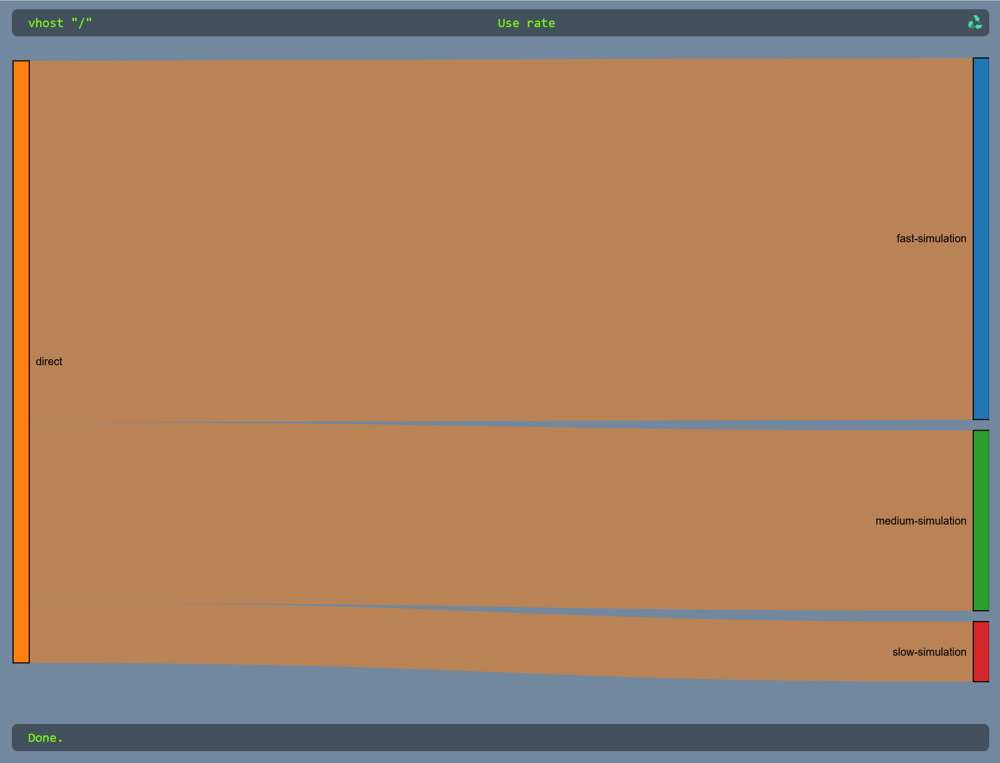

# Rabbit Sankey

## Introduction

[Sankey diagrams](https://en.wikipedia.org/wiki/Sankey_diagram) visualize the flow within a system, the width of
the arrow being proportional to the flow rate.

The idea behind this project is to <visualize> data flow within a [RabbitMQ](https://www.rabbitmq.com/) instance, the
width of the arrow being
proportional to message rate.



## Utility

This project is purely for entertainment purpose - maybe only mine actually - and it is not intended to run in
production environment!

However, it can be used as pedagogic material or for understanding data flow occurring in a RabbitMQ.

If no message is delivered between exchanges and queues, binding information is used for establishing potential data
flow.

The implicit binding between the default direct exchange (empty string) and queues is not displayed unless any message
is delivered.

## How to use

### On local

In a terminal type:

```bash
git clone https://github.com/yurivital/rabbit-sankey
cd rabbit-sankey
docker compose up -d --wait
```

Wait for healthy services and go to [http://localhost:8080](http://localhost:8080)

### In a networked environment

Rabbit Sankey is a vanilla JavaScript application, executed in user browser. The only dependencies
are [D3](https://d3js.org/) and [d3-sankey](https://github.com/d3/d3-sankey), acquired as ESM module from `jsdelivr`
CDN.

In order to display the visualization, you must place the files of this project behind a web server as static files and
change settings in `Configuration.js` file.

Rabbit Sankey rely on API provided by the [Management Plugin](https://www.rabbitmq.com/docs/management), and configured
with [detailed rate mode](https://www.rabbitmq.com/docs/management#rates-mode).

If the API Management is exposed with a different domain name (or port), you also should
set [CORS configuration in the Management Plugin](https://www.rabbitmq.com/docs/management#cors)

I strongly recommend using a dedicated/throwable read only RabbitMQ account.

## Roadmap

- [X] Display flow rate between exchange and queue.
    - [X] Based on rate
    - [X] Based on absolute number of messages
- [X] Select any vhost available in the RabbitMQ instance.
- [X] UI can switch from rate mode to message count mode (the width of the arrow is proportional to the sum of published
  messages).
- [X] Filter displayed rabbitMQ queues
- [ ] Optionally include channels and connexions in the diagram.
- [ ] Provide a packaged [OCI](https://github.com/opencontainers/image-spec) container image.
